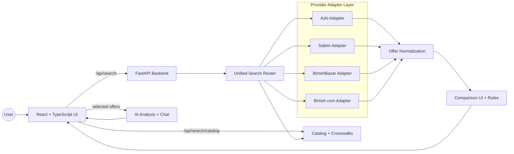
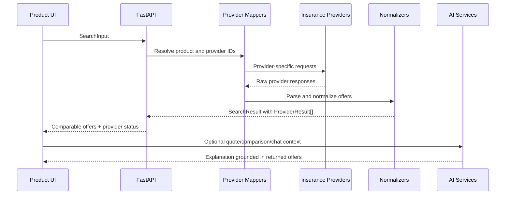

# Torob Bimeh

AI-powered insurance comparison marketplace.

Torob Bimeh is a modern fintech product experience for comparing insurance offers from multiple providers. It collects provider quotes, normalizes inconsistent upstream responses into a unified offer model, and adds AI-assisted explanations so users can understand price, coverage, discounts, installments, and trade-offs before choosing a policy.


---

## Product Overview

Traditional insurance purchasing forces users to compare offers manually across separate provider websites. Each provider has different form fields, identifiers, response shapes, pricing units, discounts, and payment options.

Torob Bimeh creates one comparison experience:

- users enter insurance details once;
- the backend maps that typed request to each provider's contract;
- provider responses are normalized into one internal quote schema;
- users compare price, coverage, installments, discounts, benefits, and insurer metadata in a single results view;
- AI explains meaningful differences without replacing the deterministic data layer.

The product is designed as a marketplace foundation: provider integrations are isolated, offer normalization is explicit, and the UI can grow from search and comparison into saved comparisons, account flows, and purchase journeys.

---

## Key Features

### Multi-provider Insurance Aggregation

- Independent adapters for Azki, Sabim, BimehBazar, and Bimeh.com.
- A single `POST /api/search` contract fans out to all providers in parallel.
- Provider failures are isolated so one unavailable source does not erase other results.
- Each provider returns an explicit status such as `ok`, `empty`, `needs_input`, `unmapped`, `unavailable`, `invalid_response`, or `unsupported`.

### Smart Comparison Engine

Torob Bimeh turns provider-specific responses into comparable `Offer` records:

- verified premium amount and source currency unit;
- price before discount, discount amount, and discount percentage when available;
- duration and financial coverage;
- installment plans, down payments, payment methods, and credit options;
- coverage codes, benefits, badges, insurer metrics, and penalties;
- raw provider offer retention for auditability and UI drill-downs.

### AI Insurance Assistant

AI is used as decision support on top of real quote data.

- Quote analysis: `POST /api/ai/quote-analysis`
- Comparison analysis: `POST /api/ai/comparison-analysis`
- Contextual chat: `POST /api/ai/chat`

The deterministic comparison table does not depend on AI. AI summaries and chat responses are scoped to the current search result or selected offers, helping users understand trade-offs without inventing prices, coverage, or provider facts.

### Multiple Insurance Products

The unified search contract supports:

- car third-party insurance;
- car body insurance;
- motorcycle third-party insurance.

The legacy provider laboratory pages are still available for validating individual adapters and upstream contracts.

---

## Architecture



### Request Lifecycle



---

## Engineering Decisions

### Adapter-based Provider Integration

Every insurance provider has an independent adapter under `backend/src/torob_bimeh/adapters`. This keeps upstream quirks out of the product UI and prevents one provider's request shape, authentication model, or response format from leaking into the shared domain.

### Unified Data Model

Provider responses are normalized into domain models in `backend/src/torob_bimeh/domain/quotes.py`. The API returns one `SearchResult` containing one `ProviderResult` per provider, and each `Offer` keeps the comparable fields needed for sorting, filtering, comparison, and AI context.

### Evidence-preserving Normalization

Torob Bimeh does not silently discard provider details. `ProviderResult.raw_response` stores the upstream JSON response, and `Offer.raw_offer` stores the source row used to create the card. Request headers, tokens, and cookies are not included in raw response payloads.

### AI as Decision Support

AI does not replace the quote pipeline. Prices, coverage, discounts, and provider status come from provider responses and deterministic normalization. AI explains the differences between real offers and is designed to stay grounded in the current result set.

### Graceful Partial Failure

Search executes provider calls independently. If one provider is unavailable or returns an invalid response, the API reports that provider's status while preserving successful results from other providers.

---

## Technical Stack

| Layer | Technology |
| --- | --- |
| Frontend | React 19, TypeScript, Vite, Tailwind CSS, Framer Motion |
| UI Components | Lucide React, React Multi Date Picker |
| Backend | Python 3.11+, FastAPI, Pydantic, Uvicorn |
| Provider HTTP | HTTPX |
| AI | OpenAI SDK-compatible client, OpenRouter configuration |
| Testing | pytest, unittest, Vitest, Node smoke tests |
| Data Contracts | Typed Pydantic schemas and provider-specific contracts |
| Local Tooling | uv, npm |

---

## Project Structure

```text
torob-bimeh
|-- backend
|   |-- scripts
|   |-- src/torob_bimeh
|   |   |-- adapters
|   |   |   |-- azki
|   |   |   |-- bimebazar
|   |   |   |-- bimeh
|   |   |   `-- sabim
|   |   |-- ai
|   |   |-- domain
|   |   `-- routers
|   `-- tests
|-- docs
|-- frontend
|   |-- labs
|   |-- public
|   |-- src
|   |   |-- assets
|   |   |-- components
|   |   |-- features
|   |   `-- styles
|   `-- tests
`-- README.md
```

---

## Core API Surface

| Endpoint | Purpose |
| --- | --- |
| `GET /api/health` | Backend health check |
| `GET /api/search/catalog` | Product-facing vehicle, insurer, duration, coverage, and option catalog |
| `POST /api/search/preview` | Provider readiness preview without leaking provider IDs to the UI |
| `POST /api/search` | Unified multi-provider insurance search |
| `POST /api/ai/quote-analysis` | AI explanation for a quote |
| `POST /api/ai/comparison-analysis` | AI summary for selected comparison offers |
| `POST /api/ai/chat` | Contextual insurance chat |

Provider-specific lab endpoints also exist for adapter validation and troubleshooting.

---

## Running Locally

### Backend

Requirements:

- Python 3.11 or newer
- `uv`

```bash
cd backend
uv sync --extra test
cp .env.example .env
uv run uvicorn torob_bimeh.main:app --reload --host 127.0.0.1 --port 8000
```

On Windows PowerShell:

```powershell
cd backend
uv sync --extra test
Copy-Item .env.example .env
uv run uvicorn torob_bimeh.main:app --reload --host 127.0.0.1 --port 8000
```

FastAPI docs are available at:

```text
http://127.0.0.1:8000/docs
```

### Frontend

Requirements:

- Node.js
- npm

```bash
cd frontend
npm install
npm run dev
```

The Vite development server runs at:

```text
http://127.0.0.1:5173/
```

Vite proxies `/api` requests to the local FastAPI backend. For a single-origin production-style preview, build the frontend and serve it from FastAPI:

```bash
cd frontend
npm run build
cd ../backend
uv run uvicorn torob_bimeh.main:app --host 127.0.0.1 --port 8000
```

---

## Environment Configuration

Copy `backend/.env.example` to `backend/.env` and fill only the values needed for your local provider and AI tests.

| Variable | Purpose |
| --- | --- |
| `AZKI_AUTHORIZATION` | Complete Azki authorization header value when upstream auth is required |
| `AZKI_DEVICE_ID` | Azki device identifier used by the backend adapter |
| `AZKI_BAGGAGE` | Optional telemetry header if a request requires it |
| `BIMEH_TOKEN` | Current Bimeh.com token from a valid browser session |
| `AI_API_KEY` | Server-side AI API key |
| `OPENROUTER_MODEL` | Model used for AI analysis and chat |
| `OPENROUTER_BASE_URL` | OpenAI-compatible provider base URL |
| `OPENROUTER_TIMEOUT_SECONDS` | AI request timeout |
| `OPENROUTER_MAX_TOKENS` | AI response token limit |
| `OPENROUTER_TEMPERATURE` | AI sampling temperature |

Never expose AI keys, provider tokens, cookies, or authorization headers to the browser. The frontend uses backend routes only.

---

## Screenshots / Demo

### Insurance Form

```text
Add screenshot: docs/screenshots/insurance-form.png
```

### Search Results

```text
Add screenshot: docs/screenshots/search-results.png
```

### Comparison Modal

```text
Add screenshot: docs/screenshots/comparison-modal.png
```

### AI Assistant

```text
Add screenshot: docs/screenshots/ai-assistant.png
```

---

## Testing

Backend:

```bash
cd backend
python -m unittest discover -s tests -p 'test_contract.py' -v
uv run pytest -q
```

Frontend:

```bash
cd frontend
npm run build
npm run test
```

Provider lab smoke tests:

```bash
cd backend
node ../frontend/tests/azki_lab_smoke.cjs
node ../frontend/tests/sabim_lab_smoke.cjs
node ../frontend/tests/bimebazar_lab_smoke.cjs
node ../frontend/tests/bimeh_lab_smoke.cjs
```

Live provider pricing depends on network access, current provider behavior, and valid local credentials. Tests that use recorded or synthetic responses validate contracts and parsing behavior, not guaranteed live market availability.

---

## Provider Labs

The repository keeps provider laboratory pages under `frontend/labs` for integration work:

| Lab | URL when backend runs locally |
| --- | --- |
| Azki | `http://127.0.0.1:8000/labs/azki.html` |
| Sabim | `http://127.0.0.1:8000/labs/sabim.html` |
| BimehBazar | `http://127.0.0.1:8000/labs/bimebazar.html` |
| Bimeh.com | `http://127.0.0.1:8000/labs/bimeh.html` |

Open lab pages through `127.0.0.1:8000`, not by double-clicking the HTML files, so the pages and API share the same origin.

---

## Current Implementation Notes

- The unified search API returns the status of all four providers for each search.
- Car third-party, car body, and motorcycle third-party products are represented in the typed `SearchInput` union.
- The frontend contains product flows, results UI, comparison components, AI analysis UI, chat UI, and local inquiry history.
- Some provider calls require valid current credentials or tokens in `backend/.env`.
- Historical HAR/sample data is used for contract validation only and should not be presented as live pricing.

---

## Roadmap

- Add more insurance providers through the adapter layer.
- Expand provider mapping coverage for edge-case vehicle models and policy histories.
- Improve personalized recommendation explanations based on user priorities.
- Add user accounts and saved comparisons.
- Add shareable comparison links and persistent quote history.
- Extend AI assistant workflows for onboarding, follow-up questions, and offer explanations.
- Add observability for provider latency, availability, and response shape changes.
- Introduce a production-ready purchase handoff or checkout flow.

---

## Documentation

- `docs/mvp-roadmap.md` - product and architecture roadmap notes.
- `docs/ui-concepts.md` - UI direction and product experience notes.
- `docs/third-car-mapping-audit.md` - mapping audit and provider evidence for car third-party insurance.

---

## License

No license file is currently included in this repository. Add one before publishing or distributing the project publicly.
